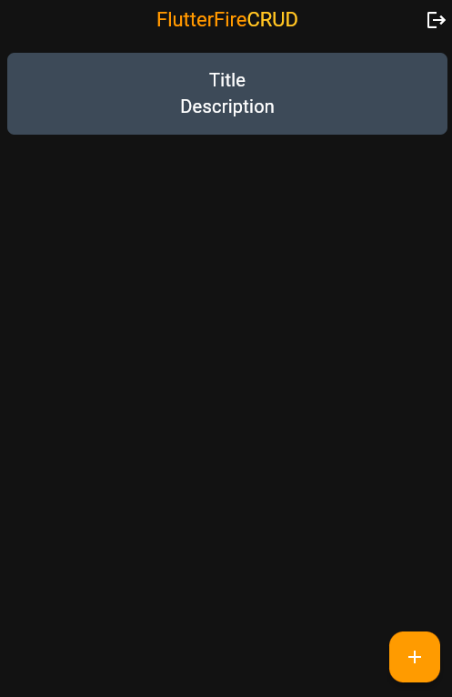
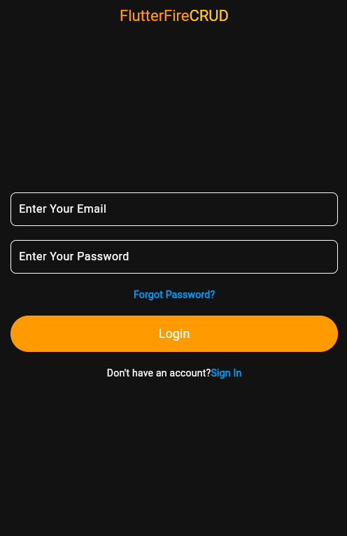
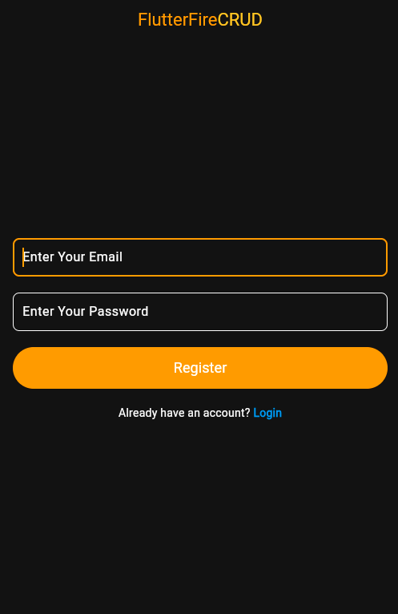
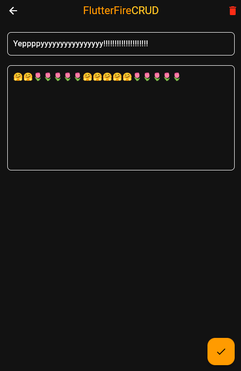
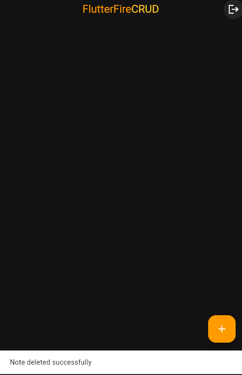

# Notes App (Flutter)

A clean and simple cross-platform notes app built using Flutter and Firebase.

## 🔐 Features
- User authentication with Firebase (Sign-up, Login)
- Add, edit, delete notes (CRUD)
- Responsive and minimal UI

## 🛠 Tech Stack
- Flutter & Dart
- Firebase Authentication & Firestore
- Git & GitHub

## 🚀 How to Run
1. Clone the repo:
git clone https://github.com/ElmasAkbar/notes_app_flutter.git

2. Run:
flutter pub get

3. Connect your Firebase project.
4. Run the app on emulator or device.

## 📸 Screenshots

### 🔐 Login Page

### 📝 Register Page

### ➕ Create Note

### 🔄 Update Note

### 🗑️ Delete Functionality

